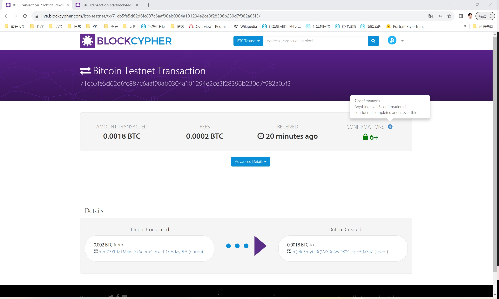
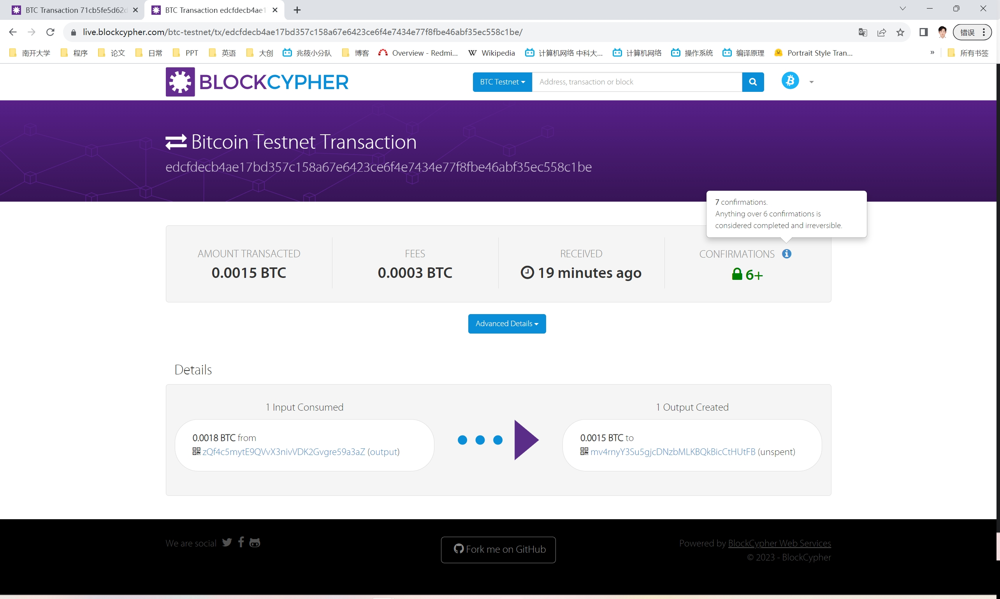

# 	<center>**区块链基础及应用实验报告**</center>

## <center>**Ex2**</center>

## <center> **网络空间安全学院 信息安全专业**</center>

## <center> **2112492 刘修铭 0939**</center>

https://github.com/lxmliu2002/Blockchain_Fundamentals_and_Applications

# Ex2a

1. 打开keygen.py文件，创建三个新账户，并将三个账户的私钥填写到ex2a.py文件中。

   ```shell
   Private key: cTzY6AedUp2ki6yhKnCN5M4pLu7E7NZL44BaxxhxwDSZATueV4sF
   Address: mmaRMk3sMBGvAxE1b1nGP94SMK7GqwoaMK
   ```
   ```shell
   Private key: cS8mXETAn6PZqM7cLnH7pMHcfLVHuzBoqnaCMXGE1KFVmoT9FYny
   Address: mpqNgShTN4GRY9njKnjfeY8GeuZ6vdfDR6
   ```
   ```shell
   Private key: cUUKg5w78M22jA5uQyRcoCwMZQKGSpDeQMT4RgBiHEnAvVAGP9Nv
   Address: mxKRmngw3sT6ZYGAYLNNybTzd6e5khgnaS
   ```
   ```python
   # 客户私钥
   cust1_private_key = CBitcoinSecret('cTzY6AedUp2ki6yhKnCN5M4pLu7E7NZL44BaxxhxwDSZATueV4sF')
   cust1_public_key = cust1_private_key.pub
   cust2_private_key = CBitcoinSecret('cS8mXETAn6PZqM7cLnH7pMHcfLVHuzBoqnaCMXGE1KFVmoT9FYny')
   cust2_public_key = cust2_private_key.pub
   cust3_private_key = CBitcoinSecret('cUUKg5w78M22jA5uQyRcoCwMZQKGSpDeQMT4RgBiHEnAvVAGP9Nv')
   cust3_public_key = cust3_private_key.pub
   ```

2. 接着补全代码，创建多重签名脚本，完成多签名交易的要求。

   ```python
   # 定义所需的签名数量
   required_signatures = 3
   # 创建包含cust1、cust2和cust3公钥的列表
   pubkeys = [cust1_public_key, cust2_public_key, cust3_public_key]
   # 创建多重签名脚本
   ex2a_txout_scriptPubKey = CScript([required_signatures] + pubkeys + [len(pubkeys), OP_CHECKMULTISIG])
   ```

3. 填写好要交易的总金额、UTXO交易ID、UTXO索引等信息。

   ```python
   amount_to_send = 0.0018  # amount of BTC in the output you're splitting minus fee
   txid_to_spend = ('8b89b2517a25e6694b17c52b2f37d595578911c928a9434aebea79ecbe7d976d')
   utxo_index = 8
   ```

4. 输出信息

   * 由于篇幅所限，输出信息将于附件output_ex2a.txt中展示。

5. faucet截图

   


# Ex2b

1. 补全多重签名脚本的解锁脚本函数

   * 使用银行私钥 (`my_private_key`) 和三个客户的私钥（`cust1_private_key`、`cust2_private_key`、`cust3_private_key`）来生成签名。然后，它将这些签名与操作码 `OP_0` 一起返回，以构建多重签名的解锁脚本。

     ```python
     def multisig_scriptSig(txin, txout, txin_scriptPubKey):
         bank_sig = create_OP_CHECKSIG_signature(txin, txout, txin_scriptPubKey, my_private_key)
         cust1_sig = create_OP_CHECKSIG_signature(txin, txout, txin_scriptPubKey, cust1_private_key)
         cust2_sig = create_OP_CHECKSIG_signature(txin, txout, txin_scriptPubKey, cust2_private_key)
         cust3_sig = create_OP_CHECKSIG_signature(txin, txout, txin_scriptPubKey, cust3_private_key)
         return [OP_0, bank_sig, cust1_sig, cust2_sig, cust3_sig]
     ```

2. 填写好要交易的总金额、UTXO交易ID、UTXO索引等信息。

   ```python
   amount_to_send = 0.0015
   txid_to_spend = '71cb5fe5d62d6fc887c6aaf90ab0304a101294e2ce3f28396b230d7f982a05f3'
   utxo_index = 0
   ```

3. 输出信息

   * 由于篇幅所限，输出信息将于附件output_ex2b.txt中展示。

4. faucet截图

   

   

