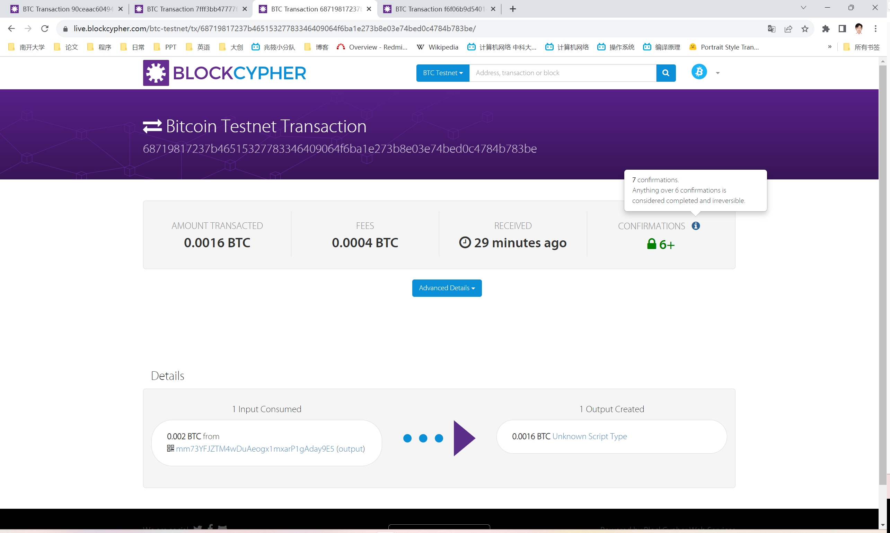
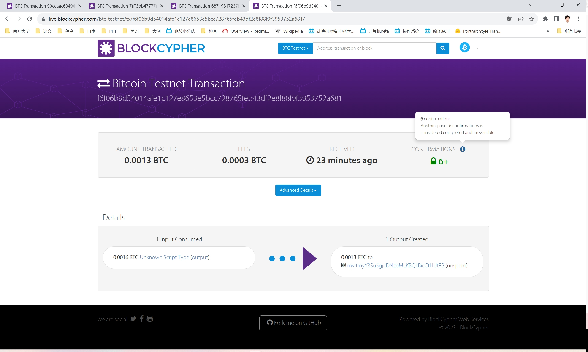

# 	<center>**区块链基础及应用实验报告**</center>

## <center>**Ex3**</center>

## <center> **网络空间安全学院 信息安全专业**</center>

## <center> **2112492 刘修铭 0939**</center>

https://github.com/lxmliu2002/Blockchain_Fundamentals_and_Applications

# Ex3a
1. 接着补全代码，构建一个交易输出锁定脚本，完成交易要求。

   ```python
   ex3a_txout_scriptPubKey = [OP_2DUP, OP_ADD, 211, OP_EQUALVERIFY, OP_SUB, 2491, OP_EQUAL]
   ```

   * `OP_2DUP`：是一个比特币脚本操作码，复制堆栈顶部的两个元素到堆栈的顶部
   * `OP_ADD`:：将堆栈顶部的两个元素相加，并将结果推送到堆栈中
   * `211`：`Student ID`的前 3 位，用于设定 $x+y$ 的值
   * `OP_EQUALVERIFY`： 比较堆栈顶部的两个元素是否相等，如果相等，则继续执行下一步操作，否则终止交易
   * `OP_SUB`：从堆栈顶部弹出两个元素，并计算它们的差，然后将结果推送到堆栈中
   * `2491`：`Student ID`的后 4 位（为了确保存在整数解，此处进行必要调整，将后4位**顺序减1**），用于设定 $x-y$ 的值
   * `OP_EQUAL`： 比较堆栈顶部的两个元素是否相等，如果相等，则返回`True`，否则返回`False`

2. 填写好交易信息。

   ```python
   amount_to_send = 0.0016
   txid_to_spend = (
       '8b89b2517a25e6694b17c52b2f37d595578911c928a9434aebea79ecbe7d976d')
   utxo_index = 9
   ```

3. 输出信息

   ```shell
   201 Created
   {
     "tx": {
       "block_height": -1,
       "block_index": -1,
       "hash": "68719817237b46515327783346409064f6ba1e273b8e03e74bed0c4784b783be",
       "addresses": [
         "mm73YFJZTM4wDuAeogx1mxarP1gAday9E5"
       ],
       "total": 160000,
       "fees": 40000,
       "size": 177,
       "vsize": 177,
       "preference": "high",
       "relayed_by": "103.20.198.138",
       "received": "2023-10-10T02:21:51.540414988Z",
       "ver": 1,
       "double_spend": false,
       "vin_sz": 1,
       "vout_sz": 1,
       "confirmations": 0,
       "inputs": [
         {
           "prev_hash": "8b89b2517a25e6694b17c52b2f37d595578911c928a9434aebea79ecbe7d976d",
           "output_index": 9,
           "script": "4730440220048f30578aba19e5f6fc22d97351316826a2b641dc7c3f81ec3c4863aa6947c5022038e290d850795e46c46329a53218fe32d0aa316fe817c0f751b5a3e2856cdbe9012103c85c1570a642c8f4eefac761bd3b62e6eae034290a80eb5b4f78bfbe13bd3502",
           "output_value": 200000,
           "sequence": 4294967295,
           "addresses": [
             "mm73YFJZTM4wDuAeogx1mxarP1gAday9E5"
           ],
           "script_type": "pay-to-pubkey-hash",
           "age": 2505212
         }
       ],
       "outputs": [
         {
           "value": 160000,
           "script": "6e9302d300889402bb0987",
           "addresses": null,
           "script_type": "unknown"
         }
       ]
     }
   }
   ```

4. faucet截图

   https://live.blockcypher.com/btc-testnet/tx/68719817237b46515327783346409064f6ba1e273b8e03e74bed0c4784b783be/

   


# Ex3b

1. 补全解锁交易输出的解锁脚本。

   * 按照前面设定，这两个数值需要满足
     $$
     \left\{
     \begin{aligned}
     &x+y=211 \\
     &x-y=2491 \\
     \end{aligned}
     \right.
     $$
   * 经过计算可以得到
     $$
     \left\{
     \begin{aligned}
     &x=1351 \\
     &y=-1140 \\
     \end{aligned}
     \right.
     $$
   * 将上面两个值作为参数传入，用作锁定脚本中的条件的数据
     ```python
     txin_scriptSig = [1351, -1140]
     ```

2. 填写好交易信息。

   ```python
   amount_to_send = 0.0013
   txid_to_spend = '68719817237b46515327783346409064f6ba1e273b8e03e74bed0c4784b783be'
   utxo_index = 0
   ```

3. 输出信息

   ```shell
   201 Created
   {
     "tx": {
       "block_height": -1,
       "block_index": -1,
       "hash": "f6f06b9d54014afe1c127e8653e5bcc728765feb43df2e8f88f9f3953752a681",
       "addresses": [
         "mv4rnyY3Su5gjcDNzbMLKBQkBicCtHUtFB"
       ],
       "total": 130000,
       "fees": 30000,
       "size": 91,
       "vsize": 91,
       "preference": "high",
       "relayed_by": "103.20.198.138",
       "received": "2023-10-10T02:26:12.190162639Z",
       "ver": 1,
       "double_spend": false,
       "vin_sz": 1,
       "vout_sz": 1,
       "confirmations": 0,
       "inputs": [
         {
           "prev_hash": "68719817237b46515327783346409064f6ba1e273b8e03e74bed0c4784b783be",
           "output_index": 0,
           "script": "024705027484",
           "output_value": 160000,
           "sequence": 4294967295,
           "script_type": "unknown",
           "age": 2531663
         }
       ],
       "outputs": [
         {
           "value": 130000,
           "script": "76a9149f9a7abd600c0caa03983a77c8c3df8e062cb2fa88ac",
           "addresses": [
             "mv4rnyY3Su5gjcDNzbMLKBQkBicCtHUtFB"
           ],
           "script_type": "pay-to-pubkey-hash"
         }
       ]
     }
   }
   ```

4. faucet截图

   https://live.blockcypher.com/btc-testnet/tx/f6f06b9d54014afe1c127e8653e5bcc728765feb43df2e8f88f9f3953752a681/

   

