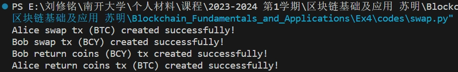
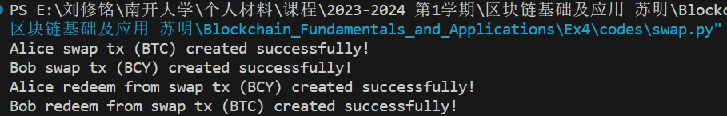

# keygen.py

Alice

```shell
Private key: cUpCNaMwCphDA1NRoeFiSNQhQghDAHCiKnAHjsAYhtC7brHWxSLu
Address: mjctYGeicFgM3q81mjsPW6YSX28ZLVHYQ2
```

Bob

```shell
Private key: cVe2gjMb76HjG8Wr5bU3CUruccBLxPLxE7uDmt5rneDRRcPaXcTZ
Address: mtYR9tdnmDjDgLtAqeDNL6EfA11TAsheha
```

为Alice在BTC上领取测试币

https://live.blockcypher.com/btc-testnet/tx/afae0a5a61fb0fe109bf1339da482428b97823c64cc76cfeded1005accad197a/

```shell
txid:afae0a5a61fb0fe109bf1339da482428b97823c64cc76cfeded1005accad197a
```


# BCY

注册账户获取API token

```shell
Token d6fe7373f62f476a876df5d633e4293d
```


创建密钥

Alice

```shell
C:\Users\lxmli>curl -X POST https://api.blockcypher.com/v1/bcy/test/addrs?token=d6fe7373f62f476a876df5d633e4293d
{
  "private": "3991895a89e87b2b8284eddfa29d25317a694f6a3dd82596581eefc9b101da5b",
  "public": "031cafc11a94e1089f952d82852dab31c18965018da5af451b225baed5ec5741d1",
  "address": "CFCn7K7hS63cv2sXEMupexF5MA64F2qLYj",
  "wif": "BqFwGNamEHpL4Du68pqBKtFCwHNJevvn3Hzfd59ykxiEcviUQS2a"
}
```

Bob

```shell
C:\Users\lxmli>curl -X POST https://api.blockcypher.com/v1/bcy/test/addrs?token=d6fe7373f62f476a876df5d633e4293d
{
  "private": "221d9a49929481c2c2a253dd08f3a1046e66df654bd1e65809b1b75624cee0a4",
  "public": "03d0475a17721d708eecd7277f1b8eb38f2480a85fee478b0fae83cffd84d29c88",
  "address": "C1UhLgQa51AuDhoB8NdjQxYrzeVN8jqNKP",
  "wif": "BpUM5wX4hYRoWRRypiccACvLRnHwBkb2uEqkaMsLd7Use4XR5qyQ"
}
```

为Bob的BCY地址领取测试币

https://live.blockcypher.com/bcy/tx/647208d0059a49fe73ea679f8642efcae095cad66269d75c8765503a778afb75/

```shell
C:\Users\lxmli>curl -d "{\"address\": \"C1UhLgQa51AuDhoB8NdjQxYrzeVN8jqNKP\", \"amount\": 1000000}" https://api.blockcypher.com/v1/bcy/test/faucet?token=d6fe7373f62f476a876df5d633e4293d
{
  "tx_ref": "647208d0059a49fe73ea679f8642efcae095cad66269d75c8765503a778afb75"
}
```

# 划分领取的币

BTC_output

https://live.blockcypher.com/btc-testnet/tx/26ef803d4a07e1b48dc8c1e7bf7bd9a630ac2e979dcc2c6a3638c0ad1877aae3/

```shell
201 Created
{
  "tx": {
    "block_height": -1,
    "block_index": -1,
    "hash": "26ef803d4a07e1b48dc8c1e7bf7bd9a630ac2e979dcc2c6a3638c0ad1877aae3",
    "addresses": [
      "mjctYGeicFgM3q81mjsPW6YSX28ZLVHYQ2"
    ],
    "total": 5500000,
    "fees": 278782,
    "size": 498,
    "vsize": 498,
    "preference": "high",
    "relayed_by": "103.20.198.139",
    "received": "2023-10-24T02:58:16.975827433Z",
    "ver": 1,
    "double_spend": false,
    "vin_sz": 1,
    "vout_sz": 10,
    "confirmations": 0,
    "inputs": [
      {
        "prev_hash": "afae0a5a61fb0fe109bf1339da482428b97823c64cc76cfeded1005accad197a",
        "output_index": 0,
        "script": "483045022100e5b8a183bedf22676852349b89b14f9dc4b76c1fbbcb414ad3ba3d0de372a75e02200861985a8c13eab3dfe0d341740e53022367299d4c04dcce09d62d0eeed32f29012103887f6bf8f22cac34e6b2c52deca82adbf1558c2a49b066c6024e56c61db8f11f",
        "output_value": 5778782,
        "sequence": 4294967295,
        "addresses": [
          "mjctYGeicFgM3q81mjsPW6YSX28ZLVHYQ2"
        ],
        "script_type": "pay-to-pubkey-hash",
        "age": 2534917
      }
    ],
    "outputs": [
      {
        "value": 550000,
        "script": "76a9142cffdd4ee53545362f755a5589ae58b7157fe4b788ac",
        "addresses": [
          "mjctYGeicFgM3q81mjsPW6YSX28ZLVHYQ2"
        ],
        "script_type": "pay-to-pubkey-hash"
      },
      {
        "value": 550000,
        "script": "76a9142cffdd4ee53545362f755a5589ae58b7157fe4b788ac",
        "addresses": [
          "mjctYGeicFgM3q81mjsPW6YSX28ZLVHYQ2"
        ],
        "script_type": "pay-to-pubkey-hash"
      },
      {
        "value": 550000,
        "script": "76a9142cffdd4ee53545362f755a5589ae58b7157fe4b788ac",
        "addresses": [
          "mjctYGeicFgM3q81mjsPW6YSX28ZLVHYQ2"
        ],
        "script_type": "pay-to-pubkey-hash"
      },
      {
        "value": 550000,
        "script": "76a9142cffdd4ee53545362f755a5589ae58b7157fe4b788ac",
        "addresses": [
          "mjctYGeicFgM3q81mjsPW6YSX28ZLVHYQ2"
        ],
        "script_type": "pay-to-pubkey-hash"
      },
      {
        "value": 550000,
        "script": "76a9142cffdd4ee53545362f755a5589ae58b7157fe4b788ac",
        "addresses": [
          "mjctYGeicFgM3q81mjsPW6YSX28ZLVHYQ2"
        ],
        "script_type": "pay-to-pubkey-hash"
      },
      {
        "value": 550000,
        "script": "76a9142cffdd4ee53545362f755a5589ae58b7157fe4b788ac",
        "addresses": [
          "mjctYGeicFgM3q81mjsPW6YSX28ZLVHYQ2"
        ],
        "script_type": "pay-to-pubkey-hash"
      },
      {
        "value": 550000,
        "script": "76a9142cffdd4ee53545362f755a5589ae58b7157fe4b788ac",
        "addresses": [
          "mjctYGeicFgM3q81mjsPW6YSX28ZLVHYQ2"
        ],
        "script_type": "pay-to-pubkey-hash"
      },
      {
        "value": 550000,
        "script": "76a9142cffdd4ee53545362f755a5589ae58b7157fe4b788ac",
        "addresses": [
          "mjctYGeicFgM3q81mjsPW6YSX28ZLVHYQ2"
        ],
        "script_type": "pay-to-pubkey-hash"
      },
      {
        "value": 550000,
        "script": "76a9142cffdd4ee53545362f755a5589ae58b7157fe4b788ac",
        "addresses": [
          "mjctYGeicFgM3q81mjsPW6YSX28ZLVHYQ2"
        ],
        "script_type": "pay-to-pubkey-hash"
      },
      {
        "value": 550000,
        "script": "76a9142cffdd4ee53545362f755a5589ae58b7157fe4b788ac",
        "addresses": [
          "mjctYGeicFgM3q81mjsPW6YSX28ZLVHYQ2"
        ],
        "script_type": "pay-to-pubkey-hash"
      }
    ]
  }
}
```

# 练习

## A

```python
def coinExchangeScript(public_key_sender, public_key_recipient, hash_of_secret):
    return [
        # fill this in!
    public_key_sender,
    OP_CHECKSIG,
    OP_IF,
        public_key_recipient,
        OP_CHECKSIG,
        OP_IF,
            OP_1,
        OP_ELSE,
            OP_DUP,
            OP_HASH160,
            hash_of_secret,
            OP_EQUAL,
            OP_IF,
                OP_1,
            OP_ELSE,
                OP_DUP,
                OP_2,
                public_key_sender,
                public_key_recipient,
                OP_CHECKMULTISIG,
            OP_ENDIF,
        OP_ENDIF,
    OP_ENDIF
    ]
```

## B

### a

```PYTHON
def coinExchangeScriptSig1(sig_recipient, secret):
    return [
        # fill this in!
    secret,
    sig_recipient
    ]
```

### b

```PYTHON
def coinExchangeScriptSig2(sig_sender, sig_recipient):
    return [
        # fill this in!
    sig_recipient,
    sig_sender
    ]
```

## C

运行swap.py

```python
broadcast_transactions = False
alice_redeems = False
```



```python
broadcast_transactions = False
alice_redeems = True
```



```python
broadcast_transactions = True
alice_redeems = False
```

output

```shell
Alice swap tx (BTC) created successfully!
201 Created
{
  "tx": {
    "block_height": -1,
    "block_index": -1,
    "hash": "c7d43a5c1adc6b9af16ca5677d89a2880655ee2fbd3cc651a31597606f10b6df",
    "addresses": [
      "mjctYGeicFgM3q81mjsPW6YSX28ZLVHYQ2"
    ],
    "total": 400000,
    "fees": 150000,
    "size": 342,
    "vsize": 342,
    "preference": "high",
    "relayed_by": "103.20.198.139",
    "received": "2023-10-24T10:18:25.200874767Z",
    "ver": 1,
    "double_spend": false,
    "vin_sz": 1,
    "vout_sz": 1,
    "confirmations": 0,
    "inputs": [
      {
        "prev_hash": "26ef803d4a07e1b48dc8c1e7bf7bd9a630ac2e979dcc2c6a3638c0ad1877aae3",
        "output_index": 1,
        "script": "483045022100de38a5748a1c8757855c86037b2095c1d13b059f104e03e7e27208d5929ab7b102201d73dcba77e9910cc6fd8704764a9a8eec06ba7e93a520e695b56a8e33e2ddb4012103887f6bf8f22cac34e6b2c52deca82adbf1558c2a49b066c6024e56c61db8f11f",
        "output_value": 550000,
        "sequence": 4294967295,
        "addresses": [
          "mjctYGeicFgM3q81mjsPW6YSX28ZLVHYQ2"
        ],
        "script_type": "pay-to-pubkey-hash",
        "age": 2534921
      }
    ],
    "outputs": [
      {
        "value": 400000,
        "script": "2103887f6bf8f22cac34e6b2c52deca82adbf1558c2a49b066c6024e56c61db8f11fac6321039f886ecc863bc71cb1b358f12ae19df33457749abe766990120d8027804ed953ac63516776a914853b775079232503df966e626618e1d388a957208763516776522103887f6bf8f22cac34e6b2c52deca82adbf1558c2a49b066c6024e56c61db8f11f21039f886ecc863bc71cb1b358f12ae19df33457749abe766990120d8027804ed953ae686868",
        "addresses": null,
        "script_type": "unknown"
      }
    ]
  }
}
Bob swap tx (BCY) created successfully!
201 Created
{
  "tx": {
    "block_height": -1,
    "block_index": -1,
    "hash": "a3bee6e140a3070ddde6dd5f745cdf00edf1f16dcf8f143fd54462a3c94db830",
    "addresses": [
      "C1UhLgQa51AuDhoB8NdjQxYrzeVN8jqNKP"
    ],
    "total": 900000,
    "fees": 100000,
    "size": 342,
    "vsize": 342,
    "preference": "high",
    "relayed_by": "103.20.198.139",
    "received": "2023-10-24T10:18:26.128916581Z",
    "ver": 1,
    "double_spend": false,
    "vin_sz": 1,
    "vout_sz": 1,
    "confirmations": 0,
    "inputs": [
      {
        "prev_hash": "647208d0059a49fe73ea679f8642efcae095cad66269d75c8765503a778afb75",
        "output_index": 0,
        "script": "483045022100ab3b7cad03cb0e98d7242744ad7a4e18c91af2194adfb13517ababaa3836e33f022022a81dce6fe7f8747972b8074be2c48cc126548dbe6215bd0c3650d31551b2d6012103d0475a17721d708eecd7277f1b8eb38f2480a85fee478b0fae83cffd84d29c88",
        "output_value": 1000000,
        "sequence": 4294967295,
        "addresses": [
          "C1UhLgQa51AuDhoB8NdjQxYrzeVN8jqNKP"
        ],
        "script_type": "pay-to-pubkey-hash",
        "age": 1036994
      }
    ],
    "outputs": [
    "outputs": [
      {
        "value": 900000,
        "script": "2103d0475a17721d708eecd7277f1b8eb38f2480a85fee478b0fae83cffd84d29c88ac6321031cafc11a94e1089f952d82852dab31c18965018da5af451b225baed5ec5741d1ac63516776a914853b775079232503df966e626618e1d388a957208763516776522103d0475a17721d708eecd7277f1b8eb38f2480a85fee478b0fae83cffd84d29c8821031cafc11a94e1089f952d82852dab31c18965018da5af451b225baed5ec5741d1ae686868",
        "addresses": null,
        "script_type": "unknown"
      }
    ]
  }
}
Sleeping for 20 minutes to let transactions confirm...
Bob return coins (BCY) tx created successfully!
Alice return coins tx (BTC) created successfully!
Sleeping for bob_locktime blocks to pass locktime...
400 Bad Request
{"error": "Error validating transaction: Transaction a09f539e5a722f31f045c86fe1298dcd5ca6e749a1ca4fa40b2b3f2552f77dd7 orphaned, missing reference 30b84dc9a36244d53f148fcf6df1f1ed00df5c745fdde6dd0d07a340e1e6bea3."}
Sleeping for alice_locktime blocks to pass locktime...
400 Bad Request
{"error": "Error validating transaction: Transaction 0961d3af066c3057edf5dcc0ee6b64b51e90d04d83ea4824c4894f62deffa14a orphaned, missing reference dfb6106f609715a351c63cbd2fee550688a2897d67a56cf19a6bdc1a5c3ad4c7."}
```

```python
broadcast_transactions = True
alice_redeems = True
```

由于前面交易已经将Bob的比特币取走，现重新领取

* 生成密钥

  ```shell
  C:\Users\lxmli>curl -X POST https://api.blockcypher.com/v1/bcy/test/addrs?token=d6fe7373f62f476a876df5d633e4293d
  {
    "private": "7bcdb57926e60e6aa751d8057ac06adc1065095ad0085edac0bad3eaae60c7d0",
    "public": "021505af54164eee76ba6d9731e16082768ad4a4ff2175b0fdf1f4effc23672dcb",
    "address": "BzFDzDVKqe7jkwpVZUdGXB2Fgx7qtq4BLq",
    "wif": "BsUgu39T6ww8HWyJt2hQhzFSnKMZheHosb7ZEV91cpJFXGnhkEg9"
  }
  ```

* 领取比特币

  ```shell
  C:\Users\lxmli>curl -d "{\"address\": \"BzFDzDVKqe7jkwpVZUdGXB2Fgx7qtq4BLq\", \"amount\": 1000000}" https://api.blockcypher.com/v1/bcy/test/faucet?token=d6fe7373f62f476a876df5d633e4293d
  {
    "tx_ref": "a0a7e88e704df710352eef2543de91ac8ce66d8b6e63a205271f22395e03d2ef"
  }
  ```

* output

  ```shell
  Alice swap tx (BTC) created successfully!
  201 Created
  {
    "tx": {
      "block_height": -1,
      "block_index": -1,
      "hash": "12042d39f7c06ba28864786198cbcd3a80fe56b0fcfe182bdd3d51703298be15",
      "addresses": [
        "mjctYGeicFgM3q81mjsPW6YSX28ZLVHYQ2"
      ],
      "total": 400000,
      "fees": 150000,
      "size": 342,
      "vsize": 342,
      "preference": "high",
      "relayed_by": "103.20.198.139",
      "received": "2023-10-24T11:29:04.883989263Z",
      "ver": 1,
      "double_spend": false,
      "vin_sz": 1,
      "vout_sz": 1,
      "confirmations": 0,
      "inputs": [
        {
          "prev_hash": "26ef803d4a07e1b48dc8c1e7bf7bd9a630ac2e979dcc2c6a3638c0ad1877aae3",
          "output_index": 3,
          "script": "483045022100f3dbbe0273b053915a9d320d745c9c3055e42f26601202726c18f3573948f9f302203b37c92b363e05f5d9d0f8b7cc7f9f7a66043cd7fcaf1fce09b3ede358f50cac012103887f6bf8f22cac34e6b2c52deca82adbf1558c2a49b066c6024e56c61db8f11f",
          "output_value": 550000,
          "sequence": 4294967295,
          "addresses": [
            "mjctYGeicFgM3q81mjsPW6YSX28ZLVHYQ2"
          ],
          "script_type": "pay-to-pubkey-hash",
          "age": 2534921
        }
      ],
      "outputs": [
        {
          "value": 400000,
          "script": "2103887f6bf8f22cac34e6b2c52deca82adbf1558c2a49b066c6024e56c61db8f11fac6321039f886ecc863bc71cb1b358f12ae19df33457749abe766990120d8027804ed953ac63516776a914853b775079232503df966e626618e1d388a957208763516776522103887f6bf8f22cac34e6b2c52deca82adbf1558c2a49b066c6024e56c61db8f11f21039f886ecc863bc71cb1b358f12ae19df33457749abe766990120d8027804ed953ae686868",
          "addresses": null,
          "script_type": "unknown"
        }
      ]
    }
  }
  Bob swap tx (BCY) created successfully!
  201 Created
  {
    "tx": {
      "block_height": -1,
      "block_index": -1,
      "hash": "9a85a6533e7eb33990f4aec2887874f4f75f4e9bc78af361db00fc3df037d9b4",
      "addresses": [
        "BzFDzDVKqe7jkwpVZUdGXB2Fgx7qtq4BLq"
      ],
      "total": 900000,
      "fees": 100000,
      "size": 341,
      "vsize": 341,
      "preference": "high",
      "relayed_by": "103.20.198.139",
      "received": "2023-10-24T11:29:06.583378309Z",
      "ver": 1,
      "double_spend": false,
      "vin_sz": 1,
      "vout_sz": 1,
      "confirmations": 0,
      "inputs": [
        {
          "prev_hash": "a0a7e88e704df710352eef2543de91ac8ce66d8b6e63a205271f22395e03d2ef",
          "output_index": 0,
          "script": "473044022012035dffecbe6626b98641e05692c919a59f509e4d8fa55d2d9291e04072c2890220154fbe0dec6479d239bc9fb52ef4e67d95362d7479105d1dd2bd2587ed3b48bf0121021505af54164eee76ba6d9731e16082768ad4a4ff2175b0fdf1f4effc23672dcb",
          "output_value": 1000000,
          "sequence": 4294967295,
          "addresses": [
            "BzFDzDVKqe7jkwpVZUdGXB2Fgx7qtq4BLq"
          ],
          "script_type": "pay-to-pubkey-hash",
          "age": 1037511
        }
      ],
      "outputs": [
        {
          "value": 900000,
          "script": "21021505af54164eee76ba6d9731e16082768ad4a4ff2175b0fdf1f4effc23672dcbac6321031cafc11a94e1089f952d82852dab31c18965018da5af451b225baed5ec5741d1ac63516776a914853b775079232503df966e626618e1d388a9572087635167765221021505af54164eee76ba6d9731e16082768ad4a4ff2175b0fdf1f4effc23672dcb21031cafc11a94e1089f952d82852dab31c18965018da5af451b225baed5ec5741d1ae686868",
          "addresses": null,
          "script_type": "unknown"
        }
      ]
    }
  }
  Sleeping for 20 minutes to let transactions confirm...
  Alice redeem from swap tx (BCY) created successfully!
  201 Created
  {
    "tx": {
      "block_height": -1,
      "block_index": -1,
      "hash": "15326eebf3bd4eeb78898c531da4db5c608891eb3af3f75a4b2213c1102a775e",
      "addresses": [
        "CFCn7K7hS63cv2sXEMupexF5MA64F2qLYj"
      ],
      "total": 800000,
      "fees": 100000,
      "size": 183,
      "vsize": 183,
      "preference": "high",
      "relayed_by": "103.20.198.139",
      "received": "2023-10-24T11:49:08.068811206Z",
      "ver": 1,
      "double_spend": false,
      "vin_sz": 1,
      "vout_sz": 1,
      "confirmations": 0,
      "inputs": [
        {
          "prev_hash": "9a85a6533e7eb33990f4aec2887874f4f75f4e9bc78af361db00fc3df037d9b4",
          "output_index": 0,
          "script": "187468697349734153656372657450617373776f726431323348304502210087d763d15a3b9073506bb85cf425abb7a45ba9764db1f76b7dd08723724ae8f502204486b9e322e76cd8dddc5c40f06864e4f65a9531056d9d29046c3f9aabd19f6101",
          "output_value": 900000,
          "sequence": 4294967295,
          "script_type": "unknown",
          "age": 1037516
        }
      ],
      "outputs": [
        {
          "value": 800000,
          "script": "76a914f22c3dd6e8ab9798943b0a57f02af4977ef863f688ac",
          "addresses": [
            "CFCn7K7hS63cv2sXEMupexF5MA64F2qLYj"
          ],
          "script_type": "pay-to-pubkey-hash"
        }
      ]
    }
  }
  Bob redeem from swap tx (BTC) created successfully!
  201 Created
  {
    "tx": {
      "block_height": -1,
      "block_index": -1,
      "hash": "22e8b9abfeb44360c5f514c1ec180913031bda5bf0b62895ea1e61ecb17f8149",
      "addresses": [
        "mtYR9tdnmDjDgLtAqeDNL6EfA11TAsheha"
      ],
      "total": 300000,
      "fees": 100000,
      "size": 182,
      "vsize": 182,
      "preference": "high",
      "relayed_by": "103.20.198.139",
      "received": "2023-10-24T11:49:08.505551691Z",
      "ver": 1,
      "double_spend": false,
      "vin_sz": 1,
      "vout_sz": 1,
      "confirmations": 0,
      "inputs": [
        {
          "prev_hash": "12042d39f7c06ba28864786198cbcd3a80fe56b0fcfe182bdd3d51703298be15",
          "output_index": 0,
          "script": "187468697349734153656372657450617373776f726431323347304402205bcede5a3cce5da6e29fc05f7469fdb1a0893f7319690fbef5bf70d3dffcc90402204c487c45b1bea526e3149b235f9371a71fbd7b1553fd9308a3958a628aeca15f01",
          "output_value": 400000,
          "sequence": 4294967295,
          "script_type": "unknown",
          "age": 2534980
        }
      ],
      "outputs": [
        {
          "value": 300000,
          "script": "76a9148ee078dd9bf2f45188c45d3f50963c85d336b0b588ac",
          "addresses": [
            "mtYR9tdnmDjDgLtAqeDNL6EfA11TAsheha"
          ],
          "script_type": "pay-to-pubkey-hash"
        }
      ]
    }
  }
  ```

  

## D

### a 解释代码内容，以及coinExchangeScript是如何工作

本次实验中补充的代码主要由两部分组成

* 第一部分是一些密钥等的补充，按照实验指导说明一步步完成即可。

  * 此处遇到的问题是Windows中cmd对单引号的不支持，经过对其进行转义后得以修复。

* 第二部分为交易脚本的编写

  * coinExchangeScript

    ```python
    def coinExchangeScript(public_key_sender, public_key_recipient, hash_of_secret):
        return [
            # fill this in!
            public_key_recipient,
            OP_CHECKSIG,
            OP_IF,
                OP_IF,
                    OP_HASH160,
                    hash_of_secret,
                    OP_EQUAL,
                    OP_IF,
                        OP_1,
                    OP_ENDIF,
                OP_ELSE,
                    public_key_recipient,
                    OP_CHECKSIG,
                    OP_IF,
                        OP_1,
                    OP_ENDIF,
                OP_ENDIF,
            OP_ENDIF
        ]
    ```

    * 该脚本首先检查接收者的身份，如果能够通过签名认证，则首先检查其是否知晓秘密x，如果知晓，则说明可以赎回；如果不知晓秘密x，但能够拥有发送者的认证签名，则说明可以赎回；否则，无法赎回。

  * coinExchangeScriptSig1

    ```python
    def coinExchangeScriptSig1(sig_recipient, secret):
        return [
            # fill this in!
        	secret,
        	sig_recipient
        ]
    ```

    * 该脚本能够实现接收者知道秘密x的情况下赎回交易

  * coinExchangeScriptSig2

    ```python
    def coinExchangeScriptSig2(sig_sender, sig_recipient):
        return [
            # fill this in!
        	sig_recipient,
        	sig_sender
        ]
    ```

    * 该脚本能够在发送方和接收方都签署事务的情况下赎回事务

### b 以Alice用coinExchangeScript向Bob发送硬币为例

#### 1）如果Bob不把钱赎回来，Alice为什么总能拿回她的钱？

* Alice知道秘密x，因此她可以通过她自己的签名与秘密x赎回脚本
* 且加之locktime机制的存在，如果Bob一段时间后未赎回，Alice将由自己的签名与秘密赎回脚本

#### 2）为什么不能用简单的1/2 multisig来解决这个问题？

* 1/2 multisig要求在赎回资金时需要两个签名，这意味着双方必须合作。如果一方不愿意提供签名，资金将无法赎回，也就是说，存在资金被锁定的情况，除非双方都同意方可解锁。
* 1/2 multisig通常需要在线签署，不适于离线交易

### c 解释Alice (Bob) 创建的一些交易内容和先后次序，以及背后的设计原理。

1. Alice 创建一个随机字符串 x 将其作为秘密，并计算其哈希值H(x)
2. Alice 创建 DepositA，将要交换的钱输入其中但不予以广播，此时这笔钱不属于任何人；
3. Alice 创建 RefundA，向 Bob 索要签名，并将其广播至网络，同时设定`alice_locktime`：如果 Bob 在该时间内未赎回，Alice 还能拿回自己的钱；
4. 如果 Bob 签署了 RefundA，Alice 会将 DepositA 广播至网络，但 RefundA 仍然保密；
5. Bob 创建 DepositB，将要交换的钱输入其中但不予以广播，此时这笔钱不属于任何人；
6. Bos 创建 RefundB，向 Alice 索要签名，并将其广播至网络，同时设定bob_locktime：如果 Alice 在该时间内未赎回，Bob 还能拿回自己的钱；
7. 如果 Alice签署了 RefundB，Bob 会将 DepositB 广播至网络，但 RefundB 仍然保密；
8. Alice 使用自己的正确签名与自己的秘密 x 赎回 DepositB，然后将秘密 x 广播至网络；
9. Bob 使用自己的正确签名与 Alice 广播的秘密 x 赎回 DepositA，完成交易。

这个设计的原理是创建一系列的交易，其中每个交易要么等待秘密 x 的哈希值，要么等待正确的签名以解锁。这使得 Alice 和 Bob 可以相互安全地进行资金交换，并确保在需要时能够取回自己的资金。

### d 以该作业为例，一次成功的跨链原子交换中，数字货币是如何流转的？如果失败，数字货币又是如何流转的？

* 成功
  1. 数字货币由交换货币的双方发送至网络，此时二人暂时失去这些数字货币的所有权；
  2. 交易的双方完成需要的签名认证等环节后，凭借自己获得的信息赎回网络上的数字货币，获得所有权，完成跨链原子交换。
* 失败
  1. 数字货币由交换货币的双方发送至网络，此时二人暂时失去这些数字货币的所有权；
  2. 如果交易失败，数字货币会最终由本人赎回，即流转回自己手中。
