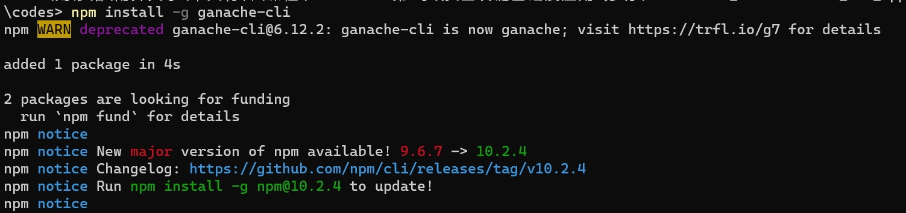
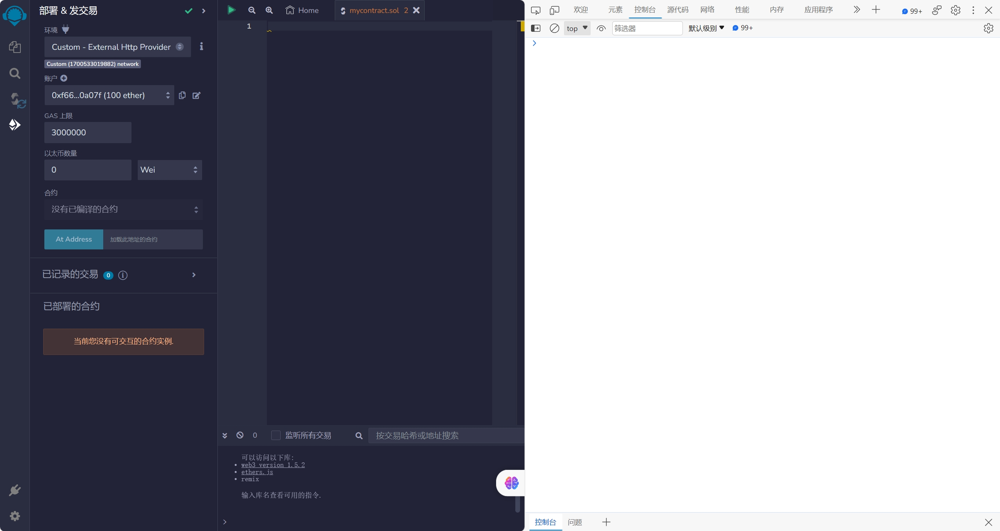
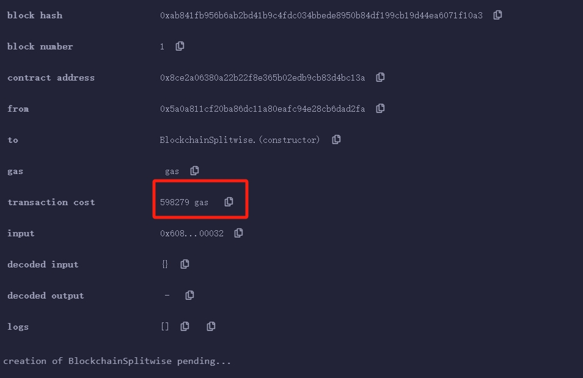
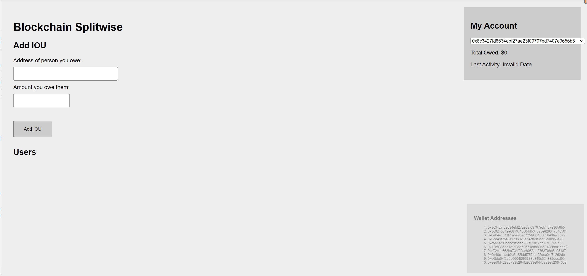
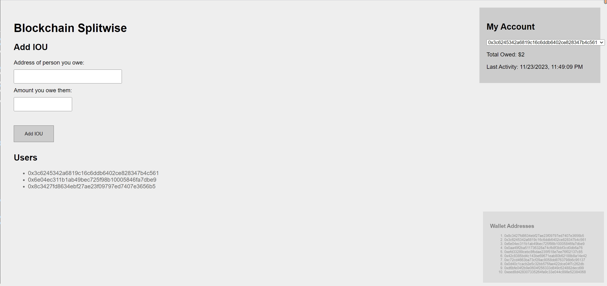
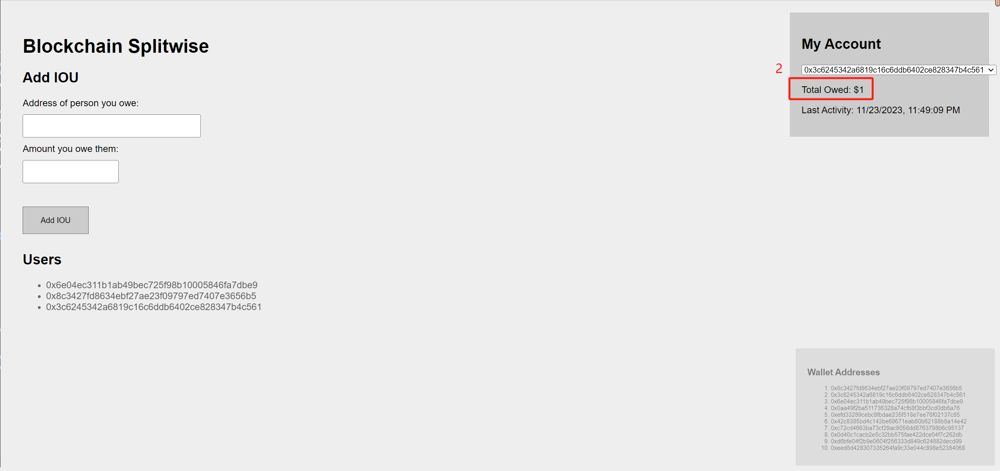
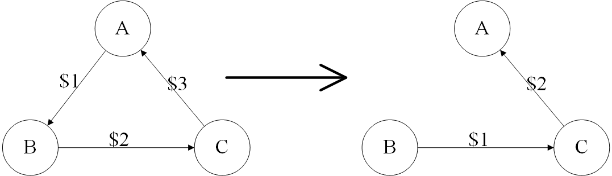

# 	<center>**区块链基础及应用实验报告**</center>

## <center>**Ex5 去中心化应用程序**</center>

## <center> **Group 31**</center>

## <center> **2112492 刘修铭 2112362 张润哲**</center>

# 一、实验要求

使用 `Solidity` 和 `web3.js` 在以太坊（Ethereum）上实现一个复杂的去中心化应用程序（DApp），编写一个智能合约和访问它的用户客户端，学习 `DApp` 的“全栈”开发。


# 二、实验过程

## （一）前期准备

按照实验手册说明，安装 `Node.js`、 `Ganache CLI` 等工具。



学习使用 `REMIX` 进行 `Solidity` 语言智能合约的编写。



使用 `IDE` 修改 `scriots.js` 构建客户端。

## （二）智能合约

本项目中，使用 `Solidity` 语言在 `REMIX` 平台上完成了智能合约的编写。

本项目的智能合约要求 `Solidity` 编译器的版本至少为 `0.4.0`。

```solidity
pragma solidity >=0.4.0;
```

为了能够轻松地追踪和管理不同地址之间的债务情况，定义了如下数据结构：

* 定义了 `Debt` 结构体，其 `amount` 属性用于表示两个地址（债务主体）间的债务金额。

  ```solidity
  struct Debt { uint32 amount; }
  ```

* 定义了一个映射结构，用于表示 $A \xrightarrow{Debt} B$ 的债务图关系。

  * 使用 `Debts[debtor][creditor]` 得到一个 `Debt` 结构体，表示债务人 `debtor` 欠债权人 `creditor` 的债务情况。
  * 为了确保合约的安全性，确保映射中的数据只能在合约内部进行修改和查询，使用 `internal`  关键字予以实现。

  ```solidity
  mapping(address => mapping(address => Debt)) internal Debts;
  ```

接着实现了 **`lookup`** 函数，用于查询返回债务人欠债权人的金额。

*  `public`表示可以从合约外部调用，而 `view` 关键字表示该函数仅作查询使用，不会修改合约的状态。

```solidity
function lookup(address debtor, address creditor) public view returns (uint32 ret) {
    ret = Debts[debtor][creditor].amount;
}
```

接着实现了 **`add_IOU`** 函数，为调用者添加一个欠条，如果已经欠钱，金额会增加。金额必须为正数。

* 按照实验要求，进行基本检查：

  * 为防止自己清除自己债务等操作，要求债务人与债权人不为同一人。

    ```solidity
    require(creditor != debtor, "Debtor and Creditor cannot be the same one!");
    ```

  * 同时，为防止恶意刷款，要求金额必须为正数。

    ```solidity
    require(amount > 0, "Amount must be greater than 0!");
    ```

* 接着按照 `min_Amount` 的情况进行讨论。`min_Amount` 表示当前路径中的最小金额。

  * 当 `min_Amount` 为 0 时，直接将债务金额增加上新的借款金额，然后返回。

    ```solidity
    if (min_Amount == 0)
    {
        debt.amount += amount;
        return;
    }
    ```

  * 当其不为 0 时。

    * 首先进行基本检查，确保债务金额和新增的借款金额总和不小于最小金额；验证传入的路径是否正确，即路径的第一个地址应该是债权人，最后一个地址应该是债务人。

      ```solidity
      require((debt.amount + amount) >= min_Amount, "The amount is smaller than min_Amount!");
      require(creditor == path[0] && debtor == path[path.length - 1], "The path is wrong!");
      ```

    * 接着遍历路径中的每一对地址，检查债务是否存在，并且是否足够扣除最小金额。如果存在，就扣除相应的最小金额。

      ```solidity
      for(uint256 i = 0; i < path.length - 1; i++)
      {
          require(Debts[path[i]][path[i + 1]].amount != 0, "The debt is not exist!");
          require(Debts[path[i]][path[i + 1]].amount >= min_Amount, "The debt does not enough to deduct the min_Amount!");
          Debts[path[i]][path[i + 1]].amount -= min_Amount;
      }
      ```

    * 最后更新债务信息。

      ```solidity
      debt.amount += amount - min_Amount;
      ```

按照实验手册要求，进行如下了 gas 的优化：

1. 将 lookup 函数声明位 view，告诉以太坊该函数不会修改状态，实现 gas 的优化；
2. 使用 require 确定运行条件，避免 gas 浪费；
3. 将函数编写在客户端，减少合约中的函数量，减少成本。

优化后可以看到合约所消耗的 gas 如下，是一个较为合理的取值。



## （三）客户端

基于已编写的智能合约的后端代码，实现了如下客户端前端的编写。

* 首先将编写好的智能合约在 `REMIX` 平台中编译并部署，将生成的 `ABI` 与部署的合约地址填写到 `scriots.js` 客户端代码的指定位置。

* 接着实现了 **`getData`** 函数，用于从合约中的 `add_IOU` 函数调用中提取数据。

  * 使用 `map` 函数遍历所有的函数调用，对每个调用应用 `dataExtractor` 函数，然后使用 `flat` 获得一个包含从函数调用中提取的数据的一维数组，去重后用作返回值。


  ```javascript
  function getData(dataExtractor, stopCondition) {
      const Calls = getAllFunctionCalls(contractAddress, 'add_IOU', stopCondition);
      return Array.from(new Set(Calls.map(Call => dataExtractor(Call)).flat()));
  }
  ```

* 实现了 **`getCreditors `**函数，用于获取与 `user` 有关的债权人。

  * 调用 `getData` 函数，提取了所有 `add_IOU ` 函数调用中的债权人信息。
  * 使用 `filter` 函数，通过调用 `BlockchainSplitwise` 函数获取 `user` 在 `creditor` 处的债务金额，筛选出债务金额大于 0 的债权人并返回。

  ```javascript
  function getCreditors(user) {
      const Creditors = getData(Call => [Call.args?.[0].toLowerCase()], null);
      return Creditors.filter(creditor => BlockchainSplitwise.lookup(user, creditor).toNumber() > 0);
  }
  ```

* 然后是 **`getUsers`** 函数，用于获取合约中 `add_IOU` 函数调用涉及的债务人与债权人，并将其作为列表返回。

  * 调用 `getData` 函数，提取了所有 `add_IOU` 函数调用中的债务人和债权人信息。

  ```javascript
  function getUsers() {
      return getData(Call => [Call.from.toLowerCase(), Call.args?.[0].toLowerCase()], null);
  }
  ```

* 实现了 **`getTotalOwed`** 函数，计算 `user` 欠所有债权人的总额并返回。

  * 调用 `getData` 函数，提取了所有 `add_IOU` 函数调用中的债务人和债权人信息。
  * 使用 `reduce` 函数对所有债权人进行迭代，累加每个债权人对特定用户的债务金额然后返回。

  ```javascript
  function getTotalOwed(user) {
      const Creditors = getData(Call => [Call.args?.[0].toLowerCase()], null);
      return Creditors.reduce((acc, creditor) => acc + BlockchainSplitwise.lookup(user, creditor).toNumber(), 0);
  }
  ```

* 实现了 **`getLastActive`**  函数，用于返回 `user` 最后一次活动的 UNIX 时间戳。

  * 调用 `getData` 函数，提取了所有 `add_IOU` 函数调用中涉及到特定用户的时间戳信息。
  * 使用 `Math.max` 函数找到数组中的最大时间戳，即特定用户最后一次活动的时间戳，然后返回。

  ```javascript
  function getLastActive(user) {
      const timeStamp = getData(Call => (Call.from.toLowerCase() === user.toLowerCase() || Call.args?.[0].toLowerCase() === user.toLowerCase()) ? [Call.timestamp] : [], Call => Call.from.toLowerCase() === user.toLowerCase() || Call.args?.[0].toLowerCase() === user.toLowerCase());
      return Math.max(...timeStamp);
  }
  ```

* 最后实现了 **`add_IOU`** 函数，用于向合约中添加一个债务记录。

  * 调用 `doBFS` 函数，查找从 `creditor` 到 `web3.eth.defaultAccount` 的路径，且节点是债权人的集合。
  * 如果找到有效路径，则将 `minDebt` 初始化为无穷大。
    * 接着遍历路径上的节点，获取相邻节点间的债务记作 `Debt`，通过 `Math.min` 来找到路径上最小的债务。
    * 将路径上最小债务和输入的债务金额之间的较小值设置为 `finalDebt`。
    * 调用 `BlockchainSplitwise.add_IOU` 函数，向区块链添加债务信息。

  * 如果没找到有效路径，则调用 `BlockchainSplitwise.add_IOU` 函数，向区块链添加债务信息，其中 `finalDebt` 设置为 0。

  ```javascript
  function add_IOU(creditor, amount) {
      const Path = doBFS(creditor, web3.eth.defaultAccount, getCreditors);
      if (Path)
  	{
          let minDebt = Infinity;
          for (let i = 1; i < Path.length; i++)
  		{
              const Debt = BlockchainSplitwise.lookup(Path[i - 1], Path[i]).toNumber();
              minDebt = Math.min(minDebt, Debt);
          }
          const finalDebt = Math.min(minDebt, amount);
          return BlockchainSplitwise.add_IOU(creditor, amount, Path, finalDebt);
      }
      return BlockchainSplitwise.add_IOU(creditor, amount, [], 0);
  }
  ```


# 三、实验结果

完成好智能合约的部署，打开 `index.html`，可以看到如下初始化页面。可以看到，每个地址的总欠款数为 `$0`（缺省值），上次调用时间为  `Invalid Date`（缺省值）。



选择第一个用户，输入第二个用户的地址，表示向第二个用户添加欠款 1，点击 `Add IOU`，可以看到，`Users` 列表中多了这两个用户的地址，用户 1 的欠款数变为 `$1`，用户 1 与用户 2 的最近调用时间变为 `11/23/2023, 11:47:30 PM`。


选择第二个用户，输入第三个用户的地址，表示向第三个用户添加欠款 2，点击 `Add IOU`，可以看到，`Users` 列表中多了这两个用户的地址，用户 2 的欠款数变为 `$2`，用户 2 与用户 3 的最近调用时间变为 `11/23/2023, 11:49:09 PM`。



选择第三个用户，输入第一个用户的地址，表示向第一个用户添加欠款 3，点击 `Add IOU`，可以看到，用户 1 的欠款数变为 `$0`，用户 2 的欠款数变为 `$1`，用户 3 的欠款数变为 `$2`，用户 3 与用户 1 的最近调用时间变为 `11/23/2023, 11:50:24 PM`。





上述过程说明，最初的债务情况形成的循环得到解决，应用程序的功能得到验证。


