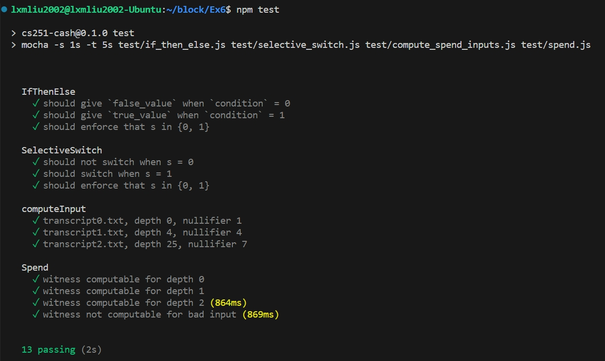

# 	<center>**区块链基础及应用实验报告**</center>

## <center>**Ex6 Tornado-zkSNARK**</center>

## <center> **Group 31**</center>

## <center> **2112492 刘修铭 2112362 张润哲**</center>

# 一、实验要求

探索私有事务（private transactions）的实现：

* 制作一个简单版本的花费 Tornado 电路；
* 生成赎回 Tornado 的有效性证明。


# 二、实验过程

## （一）前期准备

按照实验说明，进行实验的环境配置。安装完成后，运行 npm test，可以看到部分样例测试通过，说明环境配置成功。


## （二）了解 circom

阅读给定的 example.circom 电路示例，了解 circom 的语法等内容，同时完成 writeup.md 中的问题。

* writeup.md 已附于附件中。

接着按照 TUTORIAL.md 文件的指导，使用 SmallOddFactorization 电路为 $7\times 7\times 17 \times 19 = 2261$ 创建一个证明。

* 编写 circom 电路，并编译将其生成为 json 文件；

* 创建可信设置，得到 verification_key.json 文件与 proving_key.json 文件。

* 使用命令查看输入输出格式：

  

* 按照格式，将输入写入到 input.json 文件中：

  ```json
  {
  	"product": 2261,
  	"factors": [
  		7,
  		17,
  		19
  	]
  }
  ```

* 生成见证文件 witness.json；

* 生成证据，得到 proof.json 与 public.json（公开）；

* 使用 `snarkjs verify` 命令进行验证。

## （三）开关电路

### 1. IfThenElse

IfThenElse 电路验证了条件表达式的正确求值，有 1 个输出，和 3 个输入：

* condition：应该是 0 或 1；
* true_value：如果 condition 是 1，那么输出 true_value；
* false_value：如果 condition 是 0，那么输出 false_value；

对于上述要求，使用简单的 if - else 即可实现。具体代码实现如下：

```json
template IfThenElse() {
    signal input condition;
    signal input true_value;
    signal input false_value;
    signal output out;

    condition * (1 - condition) === 0; // 保证 condition 为 0 或 1
    if(condition) out <== true_value;
    else out <== false_value;
}
```

### 2. SelectiveSwitch

SelectiveSwitch 接受两个数据输入（in0、in1）并生成两个输出。如果 select(s) 输入为 1，则它会反转输出中的输入顺序。如果 s 为 0，则保留输入顺序。该要求同样可借助 if - else 语句实现。具体代码实现如下：

```json
template SelectiveSwitch() {
    signal input in0;
    signal input in1;
    signal input s;
    signal output out0;
    signal output out1;

    s * (1 - s) === 0; // 保证 s 为 0 或 1
    if(s)
    {
        out0 <== in1;
        out1 <== in0;
    }
    else
    {
        out0 <== in0;
        out1 <== in1;
    }
}
```

## （四）消费电路

按照实验手册要求，该电路应验证所提供的（私有）Merkle 路径是硬币 H(nullifier, nonce) 的有效 Merkle 证明，而其根节点的哈希值即为其输入 digest。实现思路已添加到注释中。

```json
template Spend(depth) {
    signal input digest; // 根节点（公开）
    signal input nullifier; // the nullifier（公开）
    signal private input nonce; // the nonce（私有）
    signal private input sibling[depth];
    signal private input direction[depth];

    // TODO
    component Hash[depth + 1]; // 保存每一层节点的 hash
    component switches[depth]; // 根据 direction 调整输出
	// 初始化 Hash[0] 为硬币 H(nullifier, nonce)
    Hash[0] = Mimc2();
    Hash[0].in0 <== nullifier; 
    Hash[0].in1 <== nonce;
    for (var i = 0; i < depth; ++i)
	{
        switches[i] = SelectiveSwitch();
        switches[i].in0 <== Hash[i].out;
        switches[i].in1 <== sibling[i];
        switches[i].s <== direction[i];
        Hash[i + 1] = Mimc2();
		// 左节点
        Hash[i + 1].in0 <== switches[i].out0;
		// 右节点
        Hash[i + 1].in1 <== switches[i].out1;
    }
	// 验证是否匹配
    Hash[depth].out === digest;
}
```

## （五）计算花费电路的输入

1. 借助给定的 SparseMerkleTree 类创建一个新的 SparseMerkleTree，其深度为给定的 depth。

   ```json
   let merkleTree = new SparseMerkleTree(depth);
   ```

2. 遍历 transcript 列表，构建 Merkle Tree。

   - 如果数组只有一个元素，表示其要插入 Merkle 树的硬币。

   - 如果数组将有两个元素，需要计算其哈希并插入 Merkle 树。

     ```json
     for (let i = 0; i < transcript.length; i++)
     {
       const item = transcript[i];
       if (item.length === 1) merkleTree.insert(item[0]);
       else
       {
         const nullifierHash = mimc2(item[0], item[1]);
         merkleTree.insert(nullifierHash);
         if (item[0] === nullifier) nonce = item[1];
       }
     }
     ```

3. 创建一个包含 digest、nonce 和 nullifier 的对象，作为 Spend 电路的输入。

   ```json
   let spendInput = {
     digest: merkleTree.digest,
     nonce: nonce,
     nullifier: nullifier
   };
   ```

4. 获取 Merkle 路径，将路径上的节点添加到前面创建的对象中并返回。

   ```json
   let path = merkleTree.path(mimc2(nullifier, nonce));
   
   for (let i = 0; i < path.length; i++)
   {
     const item = path[i];
     spendInput["sibling[" + i + "]"] = String(item[0]);
     spendInput["direction[" + i + "]"] = String(item[1] ? 1 : 0);
   }
   
   return spendInput;
   ```

## （六）赎回证明

按照实验手册说明，使用 circom 和 snarkjs 创建一个 SNARK 用来证明深度为 10 的 Merkle 树中存在与 transcript3.txt 相对应的  nullifier“10137284576094” 。

编写好 **二（五）** 花费电路的输入函数后，借助 compute_spend_input.js 文件中的注释，使用以下命令生成 input.json 文件。

```shell
node compute_spend_inputs.js -o input.json 10 transcript3.txt 10137284576094
```

> 代码文件中的注释缺少 `node`，对于不熟悉 js 脚本执行的同学存在一定误区。


# 三、实验结果

## （一）了解 circom

使用命令验证证明，使用之前导出的文件 verify_key.json、proof.json 和 public.json 来检查证明是否有效。


如图，命令输出 OK，说明证明有效。

## （二）电路组件测试

按照要求完成开关电路、消费电路及其输入的编写，使用 npm test 命令进行测试。



可以看到测试全部通过，说明函数编写正确。

## （三）赎回证明

按照 **二（二）** 中的流程对其验证：


如图，命令输出 OK，说明证明有效。


# 四、说明

本次实验输出文件均已置于 artifacts 文件夹下。

* proof_factor.json
* proof_spend.json
* verification_key_factor.json
* verification_key_spend.json
* writeup.md

本次实验中，**了解 circom** 部分的全部代码置于 circuits/example 文件夹中。

* circuit.json
* example.circom
* example_zn.circom
* input.json
* proof.json
* proving_key.json
* public.json
* verification_key.json
* witness.json

本次实验中，**赎回证明**部分的全部代码已置于 test/circuits/spend10 文件夹中。

* circuit.json
* input.json
* proof.json
* proving_key.json
* public.json
* spend10.circom
* verification_key.json
* witness.json
